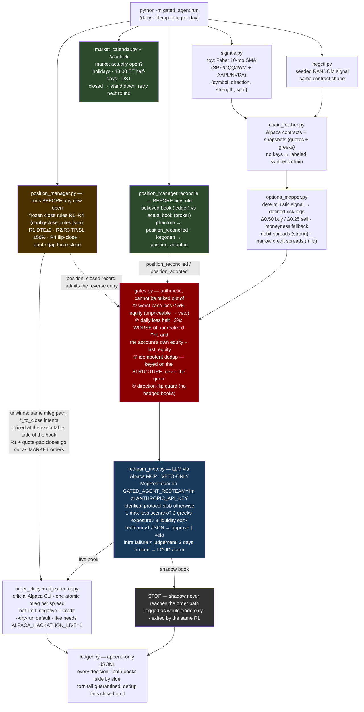

# gated-agent

**An agent that red-teams its own options risk exposure before every order.**

Built for the Alpaca AI Trading Agents Hackathon (Aug 28 – Sep 4, 2026). MIT licensed.

## The idea

Most trading-agent demos put the LLM in charge of finding alpha. We think that's
backwards. Here the signal is deliberately a **toy from public literature** —
Faber's 10-month SMA trend rule on SPY/QQQ/IWM plus mega-cap single names
(AAPL, NVDA) — and all the engineering goes
into the part that actually keeps accounts alive: **discipline**.

> **Toy signal, real discipline.** The signal is honest about being simple.
> The gates, the red-team veto loop, the negative control, and the append-only
> audit log are the product.

Two design rules follow from that:

1. **The LLM can only veto, never construct.** Orders are built and submitted by
   deterministic code (Alpaca CLI path). The LLM red-teamer interrogates each
   order — worst-case loss, greeks exposure, liquidity exit — and can kill it.
   It can never size it, price it, or invent a new one.
2. **Every live decision has a random twin.** A seeded random signal runs through
   the *identical* pipeline into a shadow book, logged side by side. If the live
   book can't beat its own coin-flip twin, the signal is noise and the log proves
   it — a built-in placebo arm.

## Architecture

Dual Alpaca tech, split by power: the **CLI** owns the deterministic order
path, the **MCP server** feeds the veto-only LLM red-teamer. Neither side can
do the other's job.



**Exit rules are config, not signals.** Positions are closed by the
pre-registered rules R1–R4 in `position_manager.py` — R1 close at DTE ≤ 2,
R2 take profit (debit +50% / credit keep 50%), R3 stop loss (debit −50% /
credit lose 1× premium), R4 close-before-flip — with parameters **frozen in
[`config/close_rules.json`](config/close_rules.json)** before the run, never
improvised intraday. The daily run evaluates closes **before** any new open,
through the same atomic mleg CLI path (`*_to_close` intents). Close orders are
priced at the **executable side** of the book — sell the long leg at the bid,
buy the short back at the ask; a mid-priced close rests instead of filling
(measured live 08-26) — and R1 goes out at **market**: the one rule that must
complete crosses the spread. The signal only ever opens; a direction flip must
wait until R4's close is confirmed as a `position_closed` ledger record (gate 4
reads exactly that — a *real* one, a rehearsed dry-run close does not release
the guard). A structure whose quotes gap 3 rounds in a row is force-closed at
market — never hold a position we can't see — and inside the R1 window an
unpriceable structure closes at market **immediately**: R1 is unconditional and
does not wait out the gap counter.

**The believed book is reconciled against the actual book, every round.** Gate
4 is only as good as the ledger's picture of what is open, and that picture is
built from order *intents*. Intents drift from reality both ways: an order that
was accepted and never filled, a position that expired or was assigned, or a
`--dry-run` rehearsal all leave the ledger believing in a position the broker
does not have — which freezes that symbol behind the flip guard with a
perfectly healthy-looking log. The reverse (a real position the ledger has
forgotten) lets the agent open against itself. So before any exit rule and long
before any open, `position_manager.reconcile()` compares the two and writes
`position_reconciled` or `position_adopted`; **the account is the source of
truth.** Direction is derived from the broker's own legs (`structure_direction`
— bull call debit and bull put credit are long, bear call credit and bear put
debit are short), read **per expiry** and combined (`book_direction`), so a
legal same-direction re-entry across two expiries is never mistaken for an
empty book — an unreadable book is a loud unknown, never a silent release.
See [docs/ADVERSARIAL-REVIEW.md](docs/ADVERSARIAL-REVIEW.md)
§2.1, which caught this live: on 08-26 the ledger believed IWM was long and the
broker held nothing.

## Signal contract (the isolation interface)

```python
{"symbol": "SPY", "direction": "long" | "short" | "neutral",
 "strength": 0.0..1.0,   # |close - SMA| / SMA, saturating at 5% distance
 "spot": 640.25}
```

Everything downstream depends only on this dict. Swap in any signal you like;
the discipline layers don't care.

## Run it (today, no account, no keys)

```bash
pip install -e ".[dev]"
python -m gated_agent.run --dry-run     # live yfinance closes -> intended orders
pytest                                  # offline unit + pipeline tests
```

Dry run prints each signal, gate verdicts, red-team verdicts, and the exact
Alpaca CLI commands it *would* run, and appends everything to
`ledger/decisions.jsonl`. Running it twice on the same day is a no-op
(idempotent per day; `--force` re-runs, order dedup still holds).

With Alpaca keys in `.env` the same command switches to the real adapter:
live option chain + equity from Alpaca, orders through the official CLI —
still under the CLI's own `--dry-run`. Real submission requires `--live`
**and** `ALPACA_HACKATHON_LIVE=1` (two independent switches; drop the
[Alpaca CLI](https://github.com/alpacahq/cli/releases) binary into `bin/`
or set `ALPACA_CLI`). Note that with keys present, a `--dry-run` still asks the
market clock first and stands down when it is closed; `--ignore-clock`
rehearses anyway and says so in the ledger.

`scripts/register_task.cmd` registers **both** weekday tasks — `GatedAgentDaily`
at 07:00 PT (= 10:00 ET, open + 30min) and `GatedAgentCloseCheck` at 12:15 PT
(= 15:15 ET, close − 45min), matching the frozen `check_times` — with hidden
windows, `StartWhenAvailable` so a box asleep at 07:00 catches up rather than
silently skipping a trading day, and logs to `logs/daily.log` /
`logs/close_check.log`. To be run on kickoff day. **Both payload scripts carry
the same two go-live switches** (`--live` and `ALPACA_HACKATHON_LIVE=1`); arming
only the opener gives you an agent that can open and cannot close.

## Unattended operation (the context the agent actually runs in)

The agent runs from Windows scheduled tasks for a week with nobody watching,
so "it works when I run it by hand" is not evidence. Live-fire testing on
08-25 found three bugs of one family — *works interactively, fails in the
scheduled-task context* — and a sweep on 08-26 found the rest. Two properties
of that context drive the design:

**No working directory.** `schtasks /Create /TR` cannot set a start-in folder,
so both tasks inherit `%windir%\system32`. Anything resolved against the CWD
therefore means something different at 07:00 than it did in a shell.
`src/gated_agent/paths.py` anchors every artifact — ledger, close log,
position state, MCP config, `.env` — on the repo root instead, and the payload
scripts `cd /d` there as well. This matters most for `ledger/decisions.jsonl`:
dedup, once-per-day idempotency, the direction-flip guard and the daily loss
halt all read that one file, so a second ledger in a second directory silently
disarms all four at once.

**No PATH, no inherited environment.** Every `python -m` entry point loads
`.env` itself (`run`, `position_manager`, `chain_fetcher`, plus the Streamlit
page), and nothing is resolved from the environment or from `PATH` at import
time — imports happen before `.env` is read. Both properties are held by
*structural* tests in `tests/test_scheduled_context.py` that scan the source,
so a **new** entry point or module-level constant fails the suite rather than
failing in production.

**Both task payloads redirect stdout and stderr** to `logs/daily.log` /
`logs/close_check.log`. A scheduled task without redirection fails silently
with nothing to debug but `rc=1`.

Adversity is exercised in `tests/test_adversity.py`: Alpaca 5xx, market
closed, red-team timeout, locked ledger, rejected order. The rule in every
case is fail **loudly** (non-zero exit, a ledger record) and **safely** (no
order sent). Two consequences worth calling out:

- The dedup key is written to the ledger *before* the order leaves. If the
  process dies between "Alpaca has it" and "the receipt is logged", the retry
  stands down instead of sending a duplicate. A burned key costs a skipped
  trade; an unburned one costs a duplicate position — fail in the cheap
  direction.
- A rejected order opens nothing. Counting it would engage the flip guard
  against a position that does not exist and that the close rules could never
  clear, freezing that symbol in one direction for the rest of the week.
- A failed signal fetch never blocks the close checks: an unreachable data
  source is no reason to stop managing money already at risk.

**Is the market even open?** Both tasks fire on a plain weekday schedule, which
knows nothing about market holidays, 13:00 ET half-days, DST, or a box that is
not in US Pacific. `market_verdict()` asks Alpaca's `/v2/clock` first (the only
source that also knows about *unscheduled* closures) and falls back to the
deterministic `market_calendar` module — because blanket-refusing on a flaky
clock endpoint would cost the whole contest, and assuming "open" would send day
orders into a shut market. Closed → a `market_closed` record, exit 0, and **no**
`run_complete`, so the next round retries.

**A red-teamer that is broken, not strict.** Fail-closed is right per order, but
an infrastructure veto and a considered veto used to leave the identical ledger
shape — so a `claude` CLI that stopped launching on day 2 would have produced a
week of plausible "RED-TEAM VETO" lines and zero trades. Infra failures now
carry `infra_failure: true`, and two consecutive days of nothing but those
raises a `redteam_infra_alarm`, a stderr banner, a non-zero exit and a
dashboard warning. Individual orders still fail closed; the alarm never
approves anything.

## Adversarial review

[`docs/ADVERSARIAL-REVIEW.md`](docs/ADVERSARIAL-REVIEW.md) is the record of a
deliberate attempt to break this agent two days before kickoff — 17 real
defects, each with a test written to fail against the pre-fix tree (50 of the
54 new tests do). It is published because the process is the point: the
interesting question about a trading agent is not whether it works, but what
its author did to find out that it didn't.

## What's real today vs stubbed awaiting the account

| Layer | Status |
|---|---|
| Faber SMA signal (yfinance) | **real, live data** |
| Options mapper (delta-targeted, moneyness fallback) | **real, deterministic, tested** |
| Risk gates (5% cap, -2% halt, dedup, flip guard) | **real, tested** |
| Option chain + equity (`chain_fetcher.py`) | **real code, tested offline** — needs keys in `.env`; without keys: labeled synthetic chain |
| Order submission (`cli_executor.py`, atomic mleg, credit sign verified) | **real code, live dry-run verified 2026-08-24** — needs keys for the account leg |
| Red-team veto protocol (`redteam.v1` JSON) | **real** — `McpRedTeam` (claude CLI + Alpaca MCP, read-only allowlist, fail-closed, infra failures tagged and alarmed) on `GATED_AGENT_REDTEAM=llm` or `ANTHROPIC_API_KEY`; identical-protocol deterministic stub otherwise |
| Close rules R1–R4 (`position_manager.py`, frozen `config/close_rules.json`) | **real, tested** — runs before opens each day; live position fetch needs keys |
| Ledger↔broker reconciliation (`reconcile`, `structure_direction`) | **real, tested** — runs every round; verified against the live account 08-26 |
| Market-open check (`market_calendar` + `/v2/clock`) | **real, tested** — holidays, half-days, DST, clock-outage fallback |
| Realized PnL / the −2% halt | **real** — booked per closed structure, cross-checked against the account's own `equity − last_equity`. A per-*fill* feed is still future work |

## Dashboard (demo URL)

`src/gated_agent/dashboard.py` is a **read-only** Streamlit page: equity,
open positions, recent orders, close-rule checks, and the decision ledger.
No order controls exist on the page.

Deploy on [Streamlit Community Cloud](https://share.streamlit.io):

1. Point the app at this repo, **main file path** `src/gated_agent/dashboard.py`.
2. Add secrets `ALPACA_API_KEY` / `ALPACA_SECRET_KEY` (paper account).
3. Local check: `pip install -e ".[dashboard]"` then
   `streamlit run src/gated_agent/dashboard.py`.

The ledger tables render only when the deployment has the runtime
`ledger/*.jsonl` files (e.g. running on the agent box); the cloud deploy
shows account state regardless.

## Honesty notes

- The signal layer contains nothing proprietary: it is the 10-month SMA rule
  from Mebane Faber's *A Quantitative Approach to Tactical Asset Allocation*,
  approximated as a 210-trading-day SMA. It is a toy on purpose.
- No keys anywhere in the repo. `.env.example` only; `.env*` is gitignored.
- `src/gated_agent/options_mapper.py`, `chain_fetcher.py`, `cli_executor.py`,
  `position_manager.py`, `dashboard.py`, the `McpRedTeam` client and the
  mapper/close-rule tests were written clean-room for this hackathon
  (orchestra's staging modules, live-data validated 2026-08-24) and are
  integrated with minimal edits: package imports, a CLI path resolver,
  `fetch_equity()`, config-file loading for the frozen close rules, and
  ledger `position_closed` coordination — each marked in-file.

## License

MIT — see [LICENSE](LICENSE).
