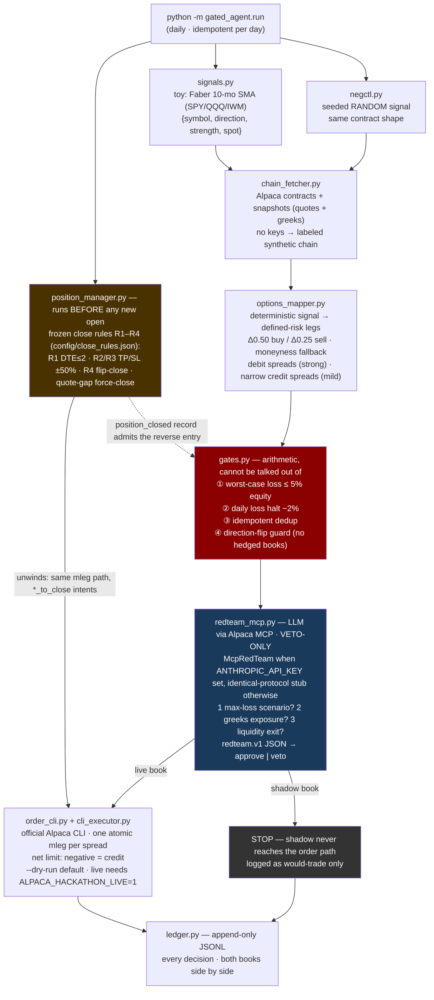

# gated-agent

**An agent that red-teams its own options risk exposure before every order.**

Built for the Alpaca AI Trading Agents Hackathon (Aug 28 – Sep 4, 2026). MIT licensed.

## The idea

Most trading-agent demos put the LLM in charge of finding alpha. We think that's
backwards. Here the signal is deliberately a **toy from public literature** —
Faber's 10-month SMA trend rule on SPY/QQQ/IWM — and all the engineering goes
into the part that actually keeps accounts alive: **discipline**.

> **Toy signal, real discipline.** The signal is honest about being simple.
> The gates, the red-team veto loop, the negative control, and the append-only
> audit log are the product.

Two design rules follow from that:

1. **The LLM can only veto, never construct.** Orders are built and submitted by
   deterministic code (Alpaca CLI path). The LLM red-teamer interrogates each
   order — worst-case loss, greeks exposure, liquidity exit — and can kill it.
   It can never size it, price it, or invent a new one.
2. **Every live decision has a random twin.** A seeded random signal runs through
   the *identical* pipeline into a shadow book, logged side by side. If the live
   book can't beat its own coin-flip twin, the signal is noise and the log proves
   it — a built-in placebo arm.

## Architecture

Dual Alpaca tech, split by power: the **CLI** owns the deterministic order
path, the **MCP server** feeds the veto-only LLM red-teamer. Neither side can
do the other's job.



<details>
<summary>ASCII version (terminal readers)</summary>

```
                ┌──────────────────────────────────────────────────────┐
                │                 python -m gated_agent.run            │
                │              (daily, idempotent per day)             │
                └──────────────────────────────────────────────────────┘
                                        │
        ┌───────────────────────────────┼──────────────────────────────┐
        ▼                                                              ▼
┌───────────────────┐                                        ┌───────────────────┐
│  signals.py       │   toy: Faber 10-mo SMA on              │  negctl.py        │
│  SPY/QQQ/IWM      │   daily closes (yfinance)              │  seeded RANDOM    │
│  {symbol,direction│                                        │  signal, same     │
│   strength,spot}  │                                        │  contract shape   │
└─────────┬─────────┘                                        └─────────┬─────────┘
          │                    IDENTICAL PIPELINE                      │
          ▼                                                            ▼
┌──────────────────────────────────────────────────────────────────────────────┐
│  chain_fetcher.py    Alpaca contracts + snapshots (quotes+greeks, one call)  │
│                      no keys -> labeled synthetic chain (offline mode)       │
└──────────────────────────────────────┬───────────────────────────────────────┘
                                       ▼
┌──────────────────────────────────────────────────────────────────────────────┐
│  options_mapper.py   deterministic signal -> defined-risk option legs        │
│  delta-targeted (Δ0.50 buy / Δ0.25 sell), moneyness fallback w/o greeks      │
│  strong: debit spread · mild long: credit PUT spread ·                       │
│  mild short: credit CALL spread   (CSP dropped: unaffordable on $700+ spot)  │
└──────────────────────────────────────┬───────────────────────────────────────┘
                                       ▼
┌──────────────────────────────────────────────────────────────────────────────┐
│  gates.py            arithmetic, cannot be talked out of                     │
│  [1] worst-case loss <= 5% equity   [2] daily loss halt at -2%               │
│  [3] idempotent dedup (same day+symbol+legs never sent twice)                │
│  [4] direction-flip guard: no reverse open while a position is open;         │
│      hedged long+short books banned (exits belong to the exit rules)         │
└──────────────────────────────────────┬───────────────────────────────────────┘
                                       ▼
┌──────────────────────────────────────────────────────────────────────────────┐
│  redteam_mcp.py      LLM via Alpaca MCP*, VETO-ONLY, 3 questions pre-order:  │
│  1. max-loss scenario?  2. greeks exposure?  3. liquidity exit cost?         │
│  emits redteam.v1 protocol JSON  →  approve | veto                           │
└───────────┬──────────────────────────────────────────────┬───────────────────┘
   live book│                                              │shadow book
            ▼                                              ▼
┌───────────────────────────┐                  ┌───────────────────────────────┐
│  order_cli.py             │                  │  STOP. shadow book never      │
│  + cli_executor.py        │                  │  reaches the order path —     │
│  official Alpaca CLI,     │                  │  logged as would-trade only   │
│  one atomic mleg order    │                  └───────────────┬───────────────┘
│  per spread; net limit    │                                  │
│  neg = credit; --dry-run  │                                  │
│  default, live needs      │                                  │
│  ALPACA_HACKATHON_LIVE=1  │                                  │
└───────────┬───────────────┘                                  │
            └──────────────────────┬───────────────────────────┘
                                   ▼
                  ┌─────────────────────────────────┐
                  │  ledger.py  append-only JSONL   │
                  │  every decision, both books,    │
                  │  side by side                   │
                  └─────────────────────────────────┘

* red-team: MCP-backed LLM when ANTHROPIC_API_KEY is set; identical-protocol
  deterministic stub otherwise — see "What's stubbed" below.
```

</details>

**Exit rules are config, not signals.** Positions are closed by the
pre-registered rules R1–R4 in `position_manager.py` — R1 close at DTE ≤ 2,
R2 take profit (debit +50% / credit keep 50%), R3 stop loss (debit −50% /
credit lose 1× premium), R4 close-before-flip — with parameters **frozen in
[`config/close_rules.json`](config/close_rules.json)** before the run, never
improvised intraday. The daily run evaluates closes **before** any new open,
through the same atomic mleg CLI path (`*_to_close` intents). The signal only
ever opens; a direction flip must wait until R4's close is confirmed as a
`position_closed` ledger record (gate 4 reads exactly that). A structure whose
quotes gap 3 rounds in a row is force-closed at market — never hold a position
we can't see.

## Signal contract (the isolation interface)

```python
{"symbol": "SPY", "direction": "long" | "short" | "neutral",
 "strength": 0.0..1.0,   # |close - SMA| / SMA, saturating at 5% distance
 "spot": 640.25}
```

Everything downstream depends only on this dict. Swap in any signal you like;
the discipline layers don't care.

## Run it (today, no account, no keys)

```bash
pip install -e ".[dev]"
python -m gated_agent.run --dry-run     # live yfinance closes -> intended orders
pytest                                  # offline unit + pipeline tests
```

Dry run prints each signal, gate verdicts, red-team verdicts, and the exact
Alpaca CLI commands it *would* run, and appends everything to
`ledger/decisions.jsonl`. Running it twice on the same day is a no-op
(idempotent per day; `--force` re-runs, order dedup still holds).

With Alpaca keys in `.env` the same command switches to the real adapter:
live option chain + equity from Alpaca, orders through the official CLI —
still under the CLI's own `--dry-run`. Real submission requires `--live`
**and** `ALPACA_HACKATHON_LIVE=1` (two independent switches; drop the
[Alpaca CLI](https://github.com/alpacahq/cli/releases) binary into `bin/`
or set `ALPACA_CLI`). `scripts/register_task.cmd` registers the weekday-
morning scheduled task (`GatedAgentDaily`, hidden window, logs to
`logs/daily.log`) — to be run on kickoff day.

## What's real today vs stubbed awaiting the account

| Layer | Status |
|---|---|
| Faber SMA signal (yfinance) | **real, live data** |
| Options mapper (delta-targeted, moneyness fallback) | **real, deterministic, tested** |
| Risk gates (5% cap, -2% halt, dedup, flip guard) | **real, tested** |
| Option chain + equity (`chain_fetcher.py`) | **real code, tested offline** — needs keys in `.env`; without keys: labeled synthetic chain |
| Order submission (`cli_executor.py`, atomic mleg, credit sign verified) | **real code, live dry-run verified 2026-08-24** — needs keys for the account leg |
| Red-team veto protocol (`redteam.v1` JSON) | **real** — `McpRedTeam` (claude CLI + Alpaca MCP, read-only allowlist, fail-closed) when `ANTHROPIC_API_KEY` is in `.env`; identical-protocol deterministic stub otherwise |
| Close rules R1–R4 (`position_manager.py`, frozen `config/close_rules.json`) | **real, tested** — runs before opens each day; live position fetch needs keys |
| Fills / realized PnL | not yet — halt gate runs off the ledger stub, exercised by tests |

## Dashboard (demo URL)

`src/gated_agent/dashboard.py` is a **read-only** Streamlit page: equity,
open positions, recent orders, close-rule checks, and the decision ledger.
No order controls exist on the page.

Deploy on [Streamlit Community Cloud](https://share.streamlit.io):

1. Point the app at this repo, **main file path** `src/gated_agent/dashboard.py`.
2. Add secrets `ALPACA_API_KEY` / `ALPACA_SECRET_KEY` (paper account).
3. Local check: `pip install -e ".[dashboard]"` then
   `streamlit run src/gated_agent/dashboard.py`.

The ledger tables render only when the deployment has the runtime
`ledger/*.jsonl` files (e.g. running on the agent box); the cloud deploy
shows account state regardless.

## Honesty notes

- The signal layer contains nothing proprietary: it is the 10-month SMA rule
  from Mebane Faber's *A Quantitative Approach to Tactical Asset Allocation*,
  approximated as a 210-trading-day SMA. It is a toy on purpose.
- No keys anywhere in the repo. `.env.example` only; `.env*` is gitignored.
- `src/gated_agent/options_mapper.py`, `chain_fetcher.py`, `cli_executor.py`,
  `position_manager.py`, `dashboard.py`, the `McpRedTeam` client and the
  mapper/close-rule tests were written clean-room for this hackathon
  (orchestra's staging modules, live-data validated 2026-08-24) and are
  integrated with minimal edits: package imports, a CLI path resolver,
  `fetch_equity()`, config-file loading for the frozen close rules, and
  ledger `position_closed` coordination — each marked in-file.

## License

MIT — see [LICENSE](LICENSE).
